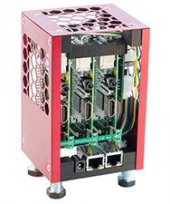
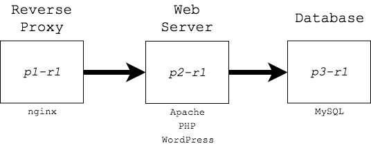

#  WordPress-3Tier

## Install Wordpress in a typical 3-Tier arcitecture onto the MiniPiRack

This ansible script configures the MiniPiRack as a 3-Tier setup for WordPress.

See [network diagram.
](./images/MiniPiRack-3-Tier-Wordpress.png)

## To run the ansible playbook

    ansible-playbook -i hosts site.yml

[MiniPiRack.com](https://www.minipirack.com) - a scalable, desktop cluster

